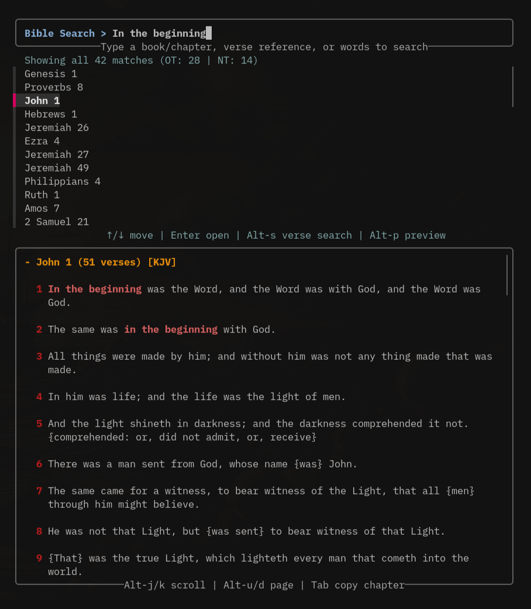

# tbible — Terminal Bible (KJV)

A fast, keyboard-driven KJV Bible browser and search tool that runs in your
terminal. Built on [fzf](https://github.com/junegunn/fzf) and SQLite (FTS5).



## Features

- **Browse or jump straight to a reference** — type `john 3`, `john 3:16`, or a
  book name (e.g. `psalms`), fzf reloads the list as you type.
- **Full-text search** with prefix matching, plus an OT/NT result breakdown.
- **Chapter and verse previews** that update as you move through the list.
- **Copy anything** — a single verse or a whole chapter — straight to the
  clipboard (Wayland and X11), with an optional desktop notification.
- **Search highlighting** in the chapter preview while you type.
- **Keyboard-first** — no mouse needed. See keybindings below.

## Requirements

- `bash` 4+
- `sqlite3` (with FTS5 support — stock on virtually all distros)
- `fzf` 0.60+
- Python 3 (only needed to build the database from source)

## Compatibility and dependencies

Tested on **Arch Linux** and **macOS 27**. Other Linux and Unix-like systems should work if they meet the requirements above. Other macOS versions should also work.

Install the dependencies with your platform's package manager:

**Arch Linux**

```sh
sudo pacman -S bash sqlite fzf python
```

**macOS (Homebrew)**

```sh
brew install bash sqlite fzf python
```

Python is only needed when building or rebuilding the database. The commands
above install it because the installer builds the database on first run.

Optional:

- `wl-clipboard` (`wl-copy`), `xclip`, or `xsel` — for copy-to-clipboard
- `libnotify` (`notify-send`) — for copy notifications

## Install

```sh
git clone https://github.com/petealeon/tbible.git
cd tbible
./install.sh             # installs tbible + builds the database
./install.sh --desktop   # also installs an app-menu entry + icon
```

The installer puts `tbible` in `~/.local/bin/` and, on first run, builds a
SQLite database from `data/kjv.json` at
`~/.local/share/terminal-bible/bible.db`.

## Usage

```sh
tbible
```

Type to filter. Use `Tab` in the main list to copy a chapter, or `Enter` to
drill into a chapter and pick a verse. Press `Alt-s` to launch a global verse
search over the whole Bible.

### Keybindings

| Key                    | Action                        |
|------------------------|-------------------------------|
| `enter`                | open chapter → verse list     |
| `enter` / `tab`        | copy verse                    |
| `tab`                  | copy chapter                  |
| `alt-s`                | verse search across the Bible  |
| `alt-p`                | toggle preview                |
| `alt-j` / `alt-k`      | scroll preview                |
| `alt-d` / `alt-u`      | scroll preview by half-page   |
| `ctrl-j` / `ctrl-k`    | move through the result list  |
| `esc`                  | back                          |

In the main view, search guidance appears under the search box, centered search
hints appear between the results and reading view, and centered reading
controls appear on the preview's bottom border. Verse-selection and global
verse-search views place result actions between the list and preview, with
preview controls on the preview's bottom border. The reading preview includes
the selected chapter and verse count.

### Examples

```
john 3:16        # exact verse
romans 8         # whole chapter
2 corinthians 5  # second-level book chapter
shepherd         # keyword search (shows OT/NT counts)
```

### Environment variables

- `DB_FILE` — path to the SQLite database (default:
  `~/.local/share/terminal-bible/bible.db`)
- `TRANSLATION` — label used in copies and previews (default: `KJV`)

## The data

The KJV text in `data/kjv.json` is in the **public domain in the United
States** — you can read, use, and redistribute it freely. (Note: the King James
Version has a Crown-patent restriction in the United Kingdom; check local law
if you distribute it there.) 66 books, 31,100 verses, with the OT/NT split used
by the search stats.

The database is generated with `scripts/build_db.py`:

```sh
python3 scripts/build_db.py            # uses defaults
python3 scripts/build_db.py --db /tmp/test.db
```

Searches are limited to verse text and omit explanatory KJV notes written in
braces with a colon, so a note such as `{Joshua: called Jesus}` is not counted
as a mention in the verse. Rebuild an existing database after updating:

```sh
python3 scripts/build_db.py
```

## Project layout

```
tbible                  main script (single dependency-free binary)
install.sh              installer
scripts/build_db.py     kjv.json → SQLite DB + FTS5 index
data/kjv.json           source text (public domain)
packaging/              desktop entry + icon
```

## License

Code: MIT (see `LICENSE`). Bible text: public domain (KJV).